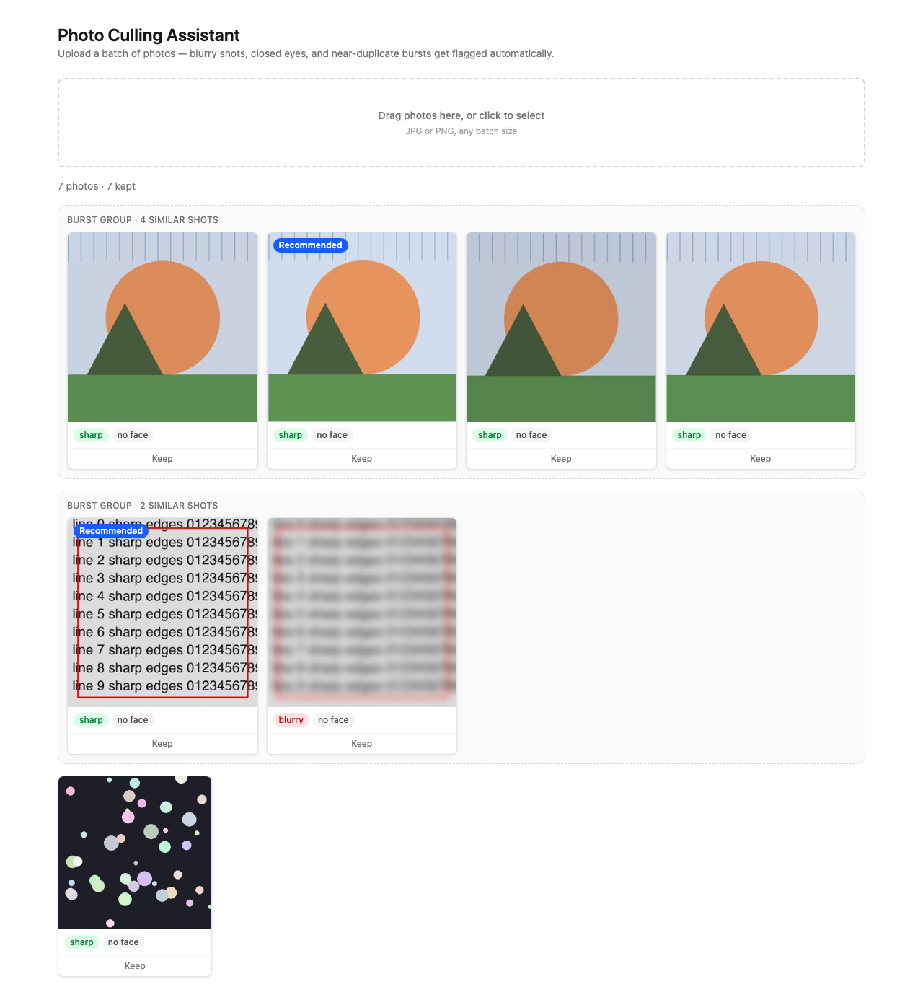

# Culld

An AI-assisted photo culling assistant for photographers. Upload a batch of photos and it automatically flags blurry shots, closed eyes, and near-duplicate bursts — then recommends the best photo in each burst — so the first pass of picking keepers takes seconds instead of an hour of scrolling.

Everything runs locally on free, open-source computer vision models. No paid APIs, no API keys.




## Features

- **Blur detection** — flags out-of-focus shots using Laplacian variance, scored on the actual subject (not the background) when a face is detected
- **Eyes-closed detection** — flags shots where the subject's eyes are closed, using face landmark geometry (Eye Aspect Ratio)
- **Burst/duplicate grouping** — clusters near-identical shots from the same burst using perceptual hashing, and recommends the sharpest one with eyes open as the keeper
- **Review UI** — a photo grid with per-photo flags, duplicate-group clustering, keep/reject toggles, and a full-size lightbox with arrow-key navigation

## How it works

- **Blur detection**: the Laplacian operator highlights edges (rapid intensity change). Sharp photos have crisp, high-contrast edges, so the Laplacian's variance across the image is high; blurry photos have smeared edges, so it's low. Scores are normalized to a fixed resolution first, since raw variance drops sharply on higher-resolution images even when they're genuinely sharp.
- **Eyes-closed detection**: a face landmark model (MediaPipe Face Mesh) locates points around each eye's contour. The Eye Aspect Ratio — vertical eyelid gap over horizontal eye width — stays high while an eye is open and collapses toward zero as it closes.
- **Duplicate/burst grouping**: a perceptual hash (unlike a cryptographic hash) gives visually similar images similar hashes. Near-identical burst shots land only a few bits apart in Hamming distance, so they can be clustered without ever comparing raw pixels.

## Tech stack

**Backend**: Python, FastAPI, SQLite (SQLAlchemy), OpenCV, MediaPipe, imagehash, Pillow
**Frontend**: React, TypeScript, Vite, Tailwind CSS

## Setup

### Backend

```bash
cd backend
python3 -m venv venv
source venv/bin/activate
pip install -r requirements.txt
uvicorn app.main:app --port 8000
```

Runs at `http://localhost:8000` (Swagger docs at `/docs`).

### Frontend

```bash
cd frontend
npm install
npm run dev
```

Runs at `http://localhost:5173`.

### Tests

```bash
cd backend
source venv/bin/activate
python -m pytest -v
```

## Known limitations

- Face detection can still miss faces in a very crowded group photo (10+ people spread across a large frame) — it degrades gracefully (flags "no face") rather than crashing, but isn't exhaustive.
- Analysis runs synchronously per photo during upload, which is fine for the batch sizes this was tested with but would need background processing for very large batches.
- Keep/reject choices are local UI state only — they aren't saved back to the server, so they reset on refresh.
